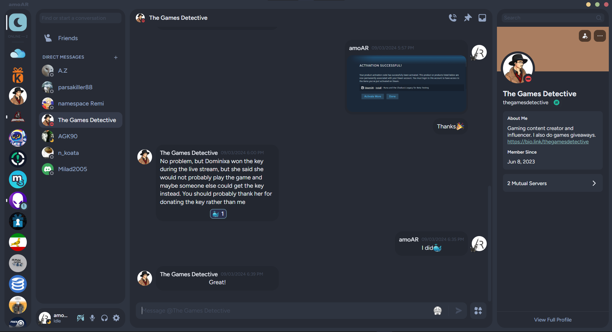

# RTLPatcher for Discord

Your messages stay aligned to the right side and Others on the other side.\
In this way, it's much easier to recognize your messages from others... Just like a normal chat!

## Features

- Moves your messages to the right side.
- Aligns contents of the all messages automatically.

## Install
1. Download `RTLPatcher.plugin.js` and save it to the plugins folder of BetterDiscord.
2. Add the following line into your `.theme.css` file or Custom CSS on settings.

```
@import url('https://raw.githubusercontent.com/amoAR/RTLPatcher/refs/heads/main/Theme.css');
```

## Screenshot

<p align="center">

</p>

> _The theme used in the image above is [midnight-discord](https://github.com/refact0r/midnight-discord)_