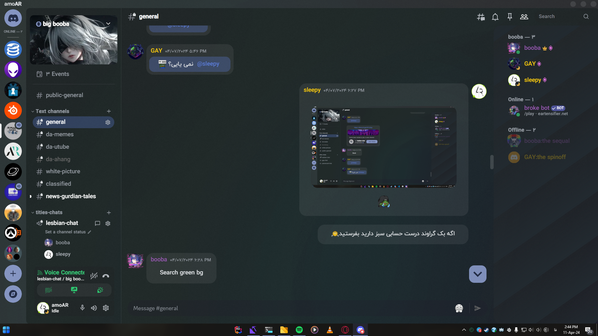

# RTLPatcher for Discord

Own messages stay aligned to one side and Other on other side!\
In this way, it's much easier to recognize your messages from others...
But Discord still doesn't even support RTL languages, so this project was created to support these languages in chat, but it became something more.

## Features

- Aligns message texts based on first word
- Aligns own messages to right of chat screen
- Places caption of attachments below instead of above
- Redesigns user area panel and upload bar
- Adds some css (i know this has nothing to do with the name of the project but discord default theme is ugly as fuck)

> As mentioned in the last part, about 900 lines of style have been added to bring Discord closer to standards of electron application. Since this wasn't goal of the project, some popular themes at BetterDiscord were used to save time.

## Quick Install

1. Install [BetterDiscord](https://betterdiscord.app)
2. Download style files from [here](https://github.com/amoAR/RTLPatcher/tree/main/Themes) and put them in:
```
%APPDATA%\BetterDiscord\themes
```
3. Download script files from [here](https://github.com/amoAR/RTLPatcher/tree/main/Plugins) and put them in:
```
%APPDATA%\BetterDiscord\plugins
```
4. Open Discord and go to settings > BETTERDISCORD section
5. Themes > _Enable_ Material-Discord, Materyal-You, MicaCold _`in order`_
6. Plugins > _Edit_ RTLPathcer > search for `const myAvatarUrl =` and replace URL of that line with your avatar URL then save and finally _Enable_ it

> You can find your unique avatar URL by pressing `ctrl + shift + i` in chat page and clicking on your avatar. Do this in Discord application, not on the browser. The result should be like this:
> <p>https://cdn.discordapp.com/avatars/{user.id}/{avatar.name}.{avatar.format}?size={avatar.size}</p>

## Be More-Stylish

Here I mention some optional items that you can easily skip if you don't want to.
- The font used in the Screenshots is called [IRANYekanFN](https://fontiran.com/fonts/iranyekan), if you don't have it installed, you can edit Material-Discord theme and put the name of your favorite font in lines 39 and 40 instead of it.
- The [Emoji Replace](https://github.com/mwittrien/BetterDiscordAddons/tree/master/Themes/EmojiReplace) plugin is also highly recommended to get rid of ugly Discord emojis.
- For a cleaner chat environment, the [RemoveChatButtons](https://github.com/BleedingBD/plugin-RemoveChatButtons) is recommended, which is used in the screenshots.

## Known Issues

- Editing the message may result in the message being shrunk. in this case, press Esc and try again.
- Message contains a lot of English text, but it's shown as RTL. be careful that the encoding of first word determines the alignment of the whole message.
- Align of my messages in chat is the same as the others. you definitely didn't enter the URL of your avatar _correctly_. Follow Step 6 of installation guide again.

## Screenshots

<p align="center">

</p>

<p align="center">

</p>

### Credits
- [Betterdiscord](https://betterdiscord.app)
- [CapnKitten](https://github.com/CapnKitten)
- [Mazeo](https://github.com/mazOnGitHub)